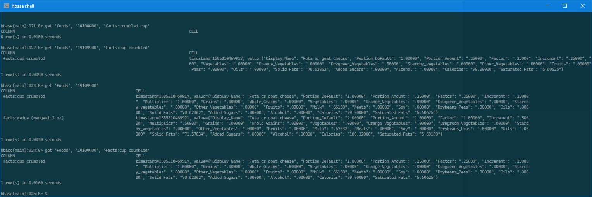

# Assignment A1: HBase
This data consists of many pairs of `<Food_Display_Row>` tags. Inside these, each row has a `<Food_Code>` (integer value), `<Display_Name>` (string), and other facts about the food in appropriately named tags.
 
1. Create a new HBase table called foods with a single column family to store the facts.  
`create ‘foods’, ‘facts’`  
2. What can be used for the row key?  
Food_Code  
3. What column family options make sense for this data?  
`Portion_Display_Name`  
4. Create code for importing the food data into the new table.  
```python
import happybase
import xml.etree.ElementTree as ET
from pprint import pprint
import json
 
# Change to your own file path
path = "D:\\Downloads\\myfoodapediadata\\Food_Display_Table.xml"
def populate():
    connection = happybase.Connection('127.0.0.1')
    table = connection.table('foods')
    tree = ET.parse(path)
    root = tree.getroot()

    for parent in root:
        row = {}
        for child in parent:
            row[child.tag] = child.text
        food_code = row.get("Food_Code")
        portion_display_name = row.get("Portion_Display_Name")
        del row["Food_Code"]
        del row["Portion_Display_Name"]
        table.put(food_code, {'facts:{0}'.format(portion_display_name) : json.dumps(row)})
    connection.close()

if __name__ == "__main__":
    populate()
```
You can use the streaming XML parsing style used earlier in this chapter for the Wikipedia import script and tailor it to the food data.
Pipe the food data into your import script on the command line to populate the table.
You can choose to use Apache Flume instead.  

5. Using the HBase shell, query the foods table for information about your favourite foods.
You may decide to implement your own map-reduce code instead.  
We want to find information about "Feta or goat cheese". We use the query `get 'foods','14104400'`. Then to find information about a specific portion display name we use the following query: `get 'foods', '14104400', 'facts:cup crumbled'`. The results are shown in the screenshot below.



